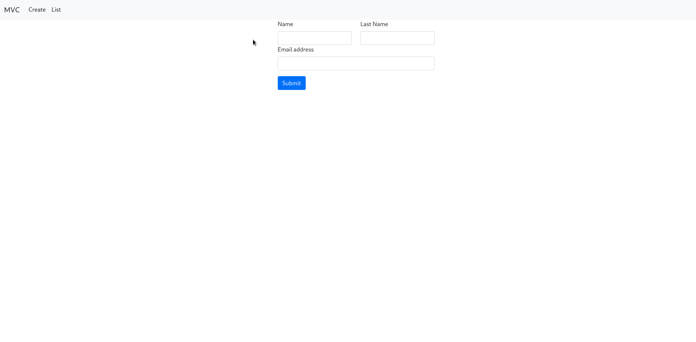

# Mongo

Projeto desenvolvido com intuíto de exemplificar um cadastro simples de um usuário.


Inicialização
```bash
docker-compose up -d --build
```

## Linguagem

* Javascript

## Banco de dados
* [MongoDb](https://www.mongodb.com/cloud/atlas/lp/try2?utm_content=rlsavisitor&utm_source=google&utm_campaign=gs_americas_rlsamultirest_search_core_brand_atlas_desktop_rlsa&utm_term=mongodb&utm_medium=cpc_paid_search&utm_ad=e&utm_ad_campaign_id=14412646314&adgroup=131761122172&gclid=Cj0KCQjw06OTBhC_ARIsAAU1yOWO7g2Cw2aucRs9MzuWBWRnzuTouieskdxWam0sRYCG96UBrHxqC0MaAp01EALw_wcB)

## Bibliotecas
* [dotenv](https://www.npmjs.com/package/dotenv)
* [ejs](https://www.npmjs.com/package/ejs)
* [express](https://www.npmjs.com/package/express)
* [mongodb](https://www.npmjs.com/package/mongodb)
* [moongose](https://www.npmjs.com/package/moongose)
* [nodemon](https://www.npmjs.com/package/nodemon)


